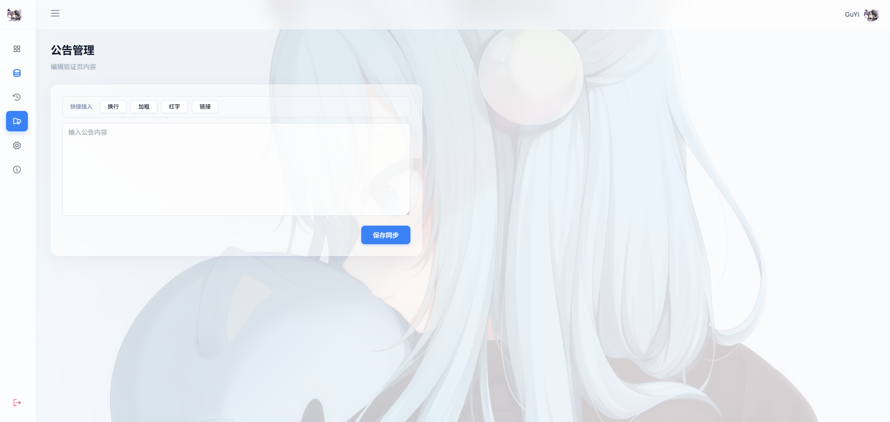

# GuYi Access Pro
**高性能、高颜值、支持跨语言的开源卡密授权验证引擎**

> 专注于跨语言、高安全性的生命周期授权管控。支持 C/C++、Flutter、易语言、Python、Go 等多语言客户端，提供完善的对接源码。

---



---

[🌐 官方网站](https://official.可爱.top/) · [🌍 备用线路](https://guyiovo.github.io/GuYi-Access-wed/) · [💬 QQ交流群](https://qm.qq.com/q/X3suYdjWAA)

---

## 核心特性

* **全链路安全**：AES-256-GCM 认证加密 + 防高频刷 + 设备指纹 hash + IP 全局黑名单。
* **应用隔离**：单后台支持无限应用，每个应用拥有独立 AppKey、卡密库、动态变量与审核策略。
* **现代界面**：Glassmorphism 毛玻璃视觉设计，响应式布局，内置仪表盘与日志审计。
* **无损迁移**：支持应用、卡密、变量、黑名单、配置的一键 JSON 导出与跨服务器还原。

---

## 快速部署

### 环境要求
* **PHP** ≥ 7.2（推荐 7.4 / 8.x）
* **MySQL**（需启用 PDO 扩展）
* **JSON 扩展**

### 安装步骤
1. 将源码上传至服务器网站根目录。
2. 访问 `http://您的域名/install.php` 运行安装向导。
3. 输入数据库与管理员信息，安装完成后自动销毁安装入口。

---

## 客户端对接

### 1. 获取 AppKey
登录后台【应用管理】，创建新应用并获取 `64位 AppKey` 与接口地址。

> 建议在客户端对密钥做混淆或加壳保护。

### 2. 接口说明
* **请求地址**：`POST /Verifyfile/api.php`
* **Content-Type**：`application/json`

**请求示例**
```json
{
  "app_key": "您的64位十六进制密钥",
  "card_code": "用户输入的卡密",
  "device_hash": "可选的硬件机器码"
}
```

**响应示例**
```json
{
  "status": "success",
  "message": "验证成功",
  "data": {
    "expire_time": "2026-12-31 23:59:59",
    "variables": {
      "update_url": "https://...",
      "notice": "欢迎使用！"
    }
  }
}
```

更多语言对接示例（C++, Rust, Go, Flutter, 易语言 等）请查看 [官方 API 文档](https://official.可爱.top/#docs)。

---

## 生态矩阵

| 客户端平台 | 服务端 / 脚本 |
| --- | --- |
| C / C++ · Rust · C# · VB.NET | Go · Node.js · Java · PHP |
| Flutter · Swift · Kotlin · Vue · React | 易语言 · Python · Lua · Shell |

---

## 开源协议

本项目采用 **[MIT License](https://opensource.org/licenses/MIT)** 开源许可，允许个人与商业自由使用。
